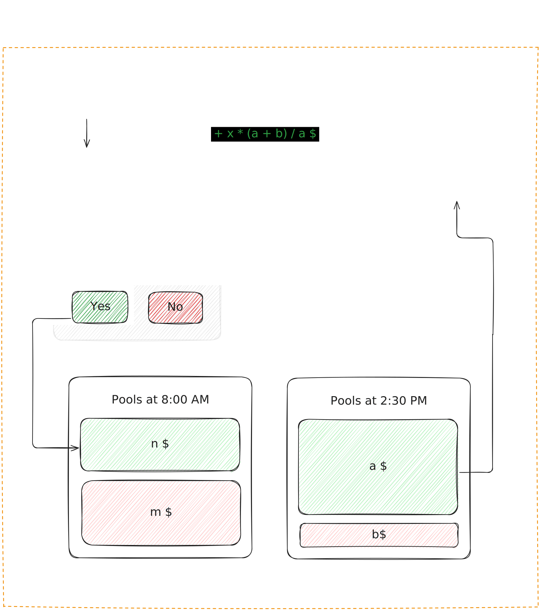

<div align="center">
  

# Wager Protocol

**Decentralized Binary Prediction Market on Solana**

[](https://solana.com/)
[](https://project-serum.github.io/anchor/)
[](LICENSE)

<sub>Constant Product AMM • On-Chain Settlement • Dynamic Pricing • Slippage Protection</sub>
</div>

<br>

## Overview

**Wager Protocol** is a high-speed, decentralized prediction market built on Solana using the Anchor framework. It allows users to speculate on binary (Yes/No) outcomes using a unique Automated Market Maker (AMM) model.

Unlike traditional order-book markets, Wager Protocol utilizes a **Constant Product (CP-AMM)** invariant (`x * y = k`) to facilitate instant liquidity, enabling users to enter and exit positions at any time before market resolution without needing a counterparty.

## Key Features

-   ** Dynamic AMM Pricing:** Prices adjust automatically based on the ratio of funds in the YES/NO pools, reflecting real-time market sentiment.
-   ** Instant Liquidity:** Exit positions early via the AMM curve (sell back to the pool) or wait for resolution to claim full winnings.
-   ** Slippage Protection:** Built-in slippage limits ensure users are not filled at unfavorable rates during high volatility.
-   ** Fee Structure:** Configurable protocol fees and developer fees, distributed automatically upon withdrawals and claims.
-   ** Secure Architecture:** Fully on-chain logic with strictly typed accounts and permissioned resolution.

##  AMM Mechanics

The protocol manages liquidity using the formula:

$$ k = P_{outcome} \times P_{other} $$

When a user withdraws (sells) amount $X$:
1.  **Update Pool:** $P_{outcome}' = P_{outcome} - X$
2.  **Maintain Constant:** $P_{other}' = k / P_{outcome}'$
3.  **Calculate Payout:** $\text{Payout} = P_{other} - P_{other}'$

This ensures that as the probability of an outcome increases (pool size grows), the cost to buy/sell adjusts exponentially, preventing arbitrage drainage.

<div align="center">
  
</div>
<br>

## Usage Example

```typescript
// 1. Create a Market
await program.methods
  .createMarket(
    "Will BTC hit $100k by 2025?",
    ["YES", "NO"],
    new anchor.BN(expiryTimestamp)
  )
  .accounts({...})
  .rpc();

// 2. Place a Bet (Mint Position)
await program.methods
  .placeBet(0, new anchor.BN(1_000_000)) // Bet 1 USDC on YES
  .accounts({...})
  .rpc();

// 3. Early Exit (Sell to AMM)
await program.methods
  .withdrawFromPosition(
    new anchor.BN(500_000), // Withdraw 0.5 shares
    new anchor.BN(450_000)  // Min payout 0.45 USDC (Slippage)
  )
  .accounts({...})
  .rpc();
```

## Development

### Prerequisites
-   Rust 1.75+
-   Solana CLI 1.17+
-   Anchor 0.29+

### Build & Deploy

```bash
# Build program
anchor build

# Run test suite
anchor test

# Deploy to Devnet
anchor deploy --provider.cluster devnet
```

## License

Distributed under the [MIT](LICENSE) license.
